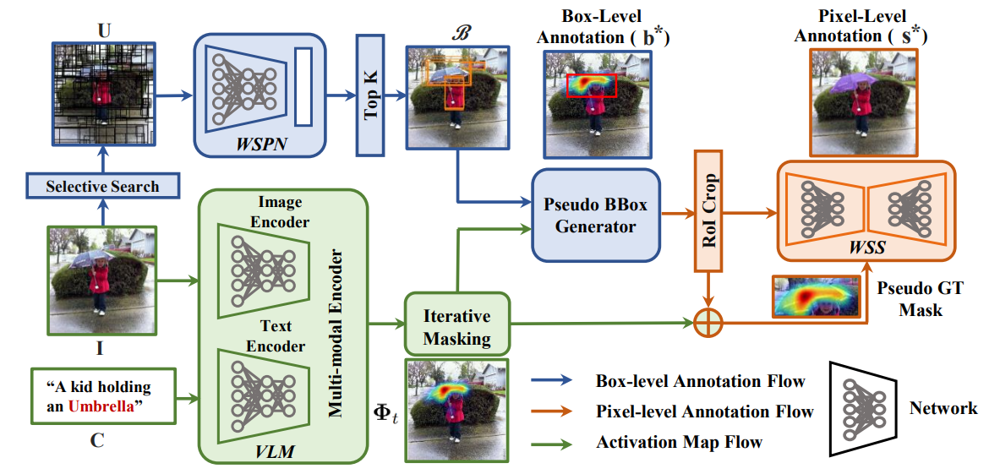

# Mask-free OVIS: Open-Vocabulary Instance Segmentation without Manual Mask Annotations [CVPR 2023]

[](https://pytorch.org/) 

[[`Project Page`](https://vibashan.github.io/mask-free-ovis-web/)] [[`arXiv`](https://arxiv.org/abs/2303.16891)] [[`PDF`](https://openaccess.thecvf.com/content/CVPR2023/papers/VS_Mask-Free_OVIS_Open-Vocabulary_Instance_Segmentation_Without_Manual_Mask_Annotations_CVPR_2023_paper.pdf)] [[`Suppli`](https://openaccess.thecvf.com/content/CVPR2023/supplemental/VS_Mask-Free_OVIS_Open-Vocabulary_CVPR_2023_supplemental.pdf)] [[`Slides`](https://docs.google.com/presentation/d/1VDJkCr5duzretJegbohLiRn0PBRsry3T/edit?usp=sharing&ouid=115004586392986149446&rtpof=true&sd=true)]  [[`BibTeX`](https://github.com/Vibashan/irg-sfda/blob/main/reference.bib)] 

<p align="center">
  
</p>

#### Contributions
- Utilize a pre-trained Vision-Language model to identify and localize the object of interest using GradCAM.
- Employ a weakly-supervised proposal generator to generate bounding box proposals and select the proposal with the highest overlap with the GradCAM map.
- Crop the image based on the selected proposal and leverage the GradCAM map as a weak prompt to extract a mask using a weakly-supervised segmentation network. 
- Using these generated masks, train an instance segmentation model (Mask-RCNN) eliminating the need for human-provided box-level or pixel-level annotations.


## Environment
```angular2
UBUNTU="18.04"
CUDA="11.0"
CUDNN="8"
```

## Pseudo-mask Generator Pipeline

<p align="center">
  
</p>

### Installation

```angular2
conda create --name pseduo_mask_gen

conda activate pseduo_mask_gen

bash pseduo_mask_gen.sh
```
### Preparation

* Referring [examples/README.md](https://github.com/Vibashan/Mask-free-OVIS/blob/main/examples/README.md) for data preparation

### Generate Pseudo-mask
* Get pseudo labels based on [ALBEF](https://arxiv.org/abs/2107.07651) and generated pseudo-mask are available [here](https://github.com/Vibashan/Mask-free-OVIS/tree/main/pseudo_label_output/vis)

```angular2
python pseudo_mask_generator.py
```

* Organize dataset in COCO format
```angular2
python prepare_coco_dataset.py
```

* Extract text embedding using [CLIP](https://arxiv.org/abs/2103.00020)

```angular2
# pip install git+https://github.com/openai/CLIP.git

python prepare_clip_embedding_for_open_vocab.py
```

* Check your final pseudo-mask by visualization

```angular2
python visualize_coco_style_dataset.py
```

## Pseudo-mask Training Pipeline

### Installation
```angular2
conda create --name maskfree_ovis
conda activate maskfree_ovis
cd $INSTALL_DIR
bash ovis.sh

git clone https://github.com/NVIDIA/apex.git
cd apex
python setup.py install --cuda_ext --cpp_ext

cd ../
cuda_dir="maskrcnn_benchmark/csrc/cuda"
perl -i -pe 's/AT_CHECK/TORCH_CHECK/' $cuda_dir/deform_pool_cuda.cu $cuda_dir/deform_conv_cuda.cu
python setup.py build develop
```
### Data Preparation
* Follow steps in [datasets/README.md](https://github.com/Vibashan/Mask-free-OVIS/blob/main/datasets/README.md) for data preparation

### Pretrain with Pseudo-Labels
```angular2
python -m torch.distributed.launch --nproc_per_node=8 tools/train_net.py  --distributed \
--config-file configs/pretrain_pseduo_mask.yaml OUTPUT_DIR $OUTPUT_DIR
```

### Finetune
```angular2
python -m torch.distributed.launch --nproc_per_node=8 tools/train_net.py  --distributed \
--config-file configs/finetune.yaml MODEL.WEIGHT $PATH_TO_PRETRAIN_MODEL  OUTPUT_DIR $OUTPUT_DIR
```

### Inference
'Coming Soon...!!!'

## Citation

If you found Mask-free OVIS useful in your research, please consider starring ⭐ us on GitHub and citing 📚 us in your research!

```bibtex
@inproceedings{vs2023mask,
  title={Mask-free OVIS: Open-Vocabulary Instance Segmentation without Manual Mask Annotations},
  author={VS, Vibashan and Yu, Ning and Xing, Chen and Qin, Can and Gao, Mingfei and Niebles, Juan Carlos and Patel, Vishal M and Xu, Ran},
  booktitle={Proceedings of the IEEE/CVF Conference on Computer Vision and Pattern Recognition},
  pages={23539--23549},
  year={2023}
}
```

## Acknowledgement

The codebase is build on top of [PB-OVD](https://github.com/salesforce/PB-OVD), [CMPL](https://github.com/hbdat/cvpr22_cross_modal_pseudo_labeling/tree/main) and [Wetectron](https://github.com/NVlabs/wetectron).
